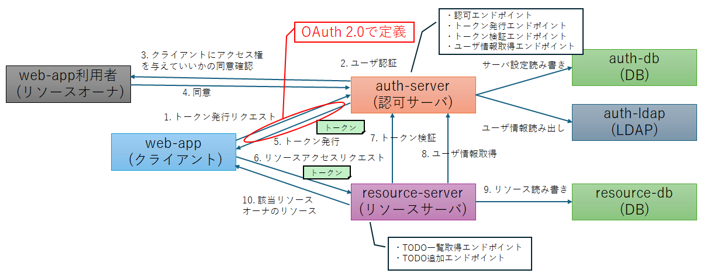

Hello OAuth 2.0
===

## 概要

- このリポジトリは、OAuth 2.0の4つのフロー（Authorization Code Flow、Client Credentials Flow、Resource Owner Password Credentials Flow, Client Credentials Flow）を実際に動作させるためのデモ環境を提供します。
- OAuth 2.0の動作を理解し、テストするために利用できます。



## デモ環境の起動

- 下記でDockerコンテナを起動してログ出力が安定するまで待つ

```
docker compose build
./clean.sh
docker compose up
```

## Webアプリケーションへのアクセス方法

- ブラウザで `http://localhost:3000` にアクセス
- 認証情報
  - username: `user01`
  - password: `user01`

## 認可サーバ(Keycloak)管理画面へのアクセス方法

- ブラウザで `http://localhost:8080` にアクセス
  - username: `admin`
  - password: `admin`
